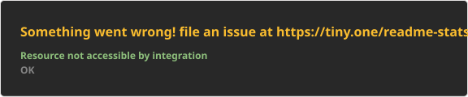

# Greetings, I am Aleksandr 🤝

R&D Engineer at Synopsys · MSc Informatics (Grenoble INP – Ensimag / HKUST) · BSc Software Engineering (ETU LETI)

My interests lie at the intersection of **network protocol design**, **distributed systems**, and **applied cryptography** — particularly protocols that resist traffic analysis, secure peer-to-peer architectures, and hybrid transport systems. On the engineering side I work across backend systems, DevOps tooling, and code generation pipelines.

I also write about systems programming on my [blog](https://pseusys.github.io/pseusys/).

## I am proud of

    
    

    
    

## I mostly use

    

## My GitHub stats

    

## My WakaTime stats

<!--START_SECTION:waka-->
<!--END_SECTION:waka-->

## This repo

Look [here](./DEVELOPMENT.md) to find out about this repo development and building!

## Support me

If you would like to support one of my projects, please, use one of the following cryptocurrencies:

| Name | Wallet | Icon |
|:---:|:---:|:---:|
| TRON (TRX) | `TL2XNcMELXiW2uUwbJ5M9TA71UwCM3W9dL` |  |
| Bitcoin (BTC) | `bc1qswuvn6x6ntw5uhp5rj0ghpgtr2l6u3lpfgau00` |  |
| Ethereum (ETH) | `0xEaAaBD955CD1CcFCA7c5bf7567fAc4Dd2d2F543f` |  |
