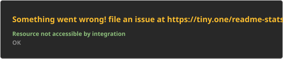

# Greetings, I am Aleksandr 🤝

R&D Engineer at Synopsys · MSc Informatics (Grenoble INP – Ensimag / HKUST) · BSc Software Engineering (ETU LETI)

My interests span **network protocol design**, **distributed systems**, **applied cryptography**, and **systems security** — with a focus on privacy, resilience, and rigorous specification. I am open to research directions across computer science where these themes intersect, including post-quantum cryptography, privacy-preserving computation, edge computing, and ML for network security. On the engineering side I work across backend systems, DevOps tooling, and code generation pipelines.

I also write about systems programming on my [blog](https://pseusys.github.io/pseusys/).

## I mostly use

<p align="center">
    
</p>

## My GitHub stats

<p align="center">
    
</p>

## My WakaTime stats

<!--START_SECTION:waka-->


**🐱 My GitHub Data** 

> 📦 375.6 kB Used in GitHub's Storage 
 > 
> 🏆 608 Contributions in the Year 2026
 > 
> 🚫 Not Opted to Hire
 > 
> 📜 35 Public Repositories 
 > 
> 🔑 34 Private Repositories 
 > 
**I'm a Night 🦉** 

```text
🌞 Morning                4547 commits        ⣿⣿⣿⣿⣿⣀⣀⣀⣀⣀⣀⣀⣀⣀⣀⣀⣀⣀⣀⣀⣀⣀⣀⣀⣀   19.31 % 
🌆 Daytime                5871 commits        ⣿⣿⣿⣿⣿⣿⣀⣀⣀⣀⣀⣀⣀⣀⣀⣀⣀⣀⣀⣀⣀⣀⣀⣀⣀   24.93 % 
🌃 Evening                7718 commits        ⣿⣿⣿⣿⣿⣿⣿⣿⣀⣀⣀⣀⣀⣀⣀⣀⣀⣀⣀⣀⣀⣀⣀⣀⣀   32.77 % 
🌙 Night                  5416 commits        ⣿⣿⣿⣿⣿⣿⣀⣀⣀⣀⣀⣀⣀⣀⣀⣀⣀⣀⣀⣀⣀⣀⣀⣀⣀   23.00 % 
```


🤖 **AI Coding This Week** 

```text
⏱ AI Coding Time: 8 hrs 36 mins (96.69%)

✍️ 6,144 lines written by AI, 2 lines written by hand (99.97% AI-written)

🔤 23,333,832 Input Tokens, 1,180,999 Output Tokens

💵 $237.47 Estimated AI Cost This Week

🧠 11 AI Sessions, 42 AI Prompts

Opus                     6,168 lines         ⣿⣿⣿⣿⣿⣿⣿⣿⣿⣿⣿⣿⣿⣿⣿⣿⣿⣿⣿⣿⣿⣿⣿⣿⣿   100.00 % 
Sonnet                   0 lines             ⣀⣀⣀⣀⣀⣀⣀⣀⣀⣀⣀⣀⣀⣀⣀⣀⣀⣀⣀⣀⣀⣀⣀⣀⣀   00.00 % 
Claude-Code              0 lines             ⣀⣀⣀⣀⣀⣀⣀⣀⣀⣀⣀⣀⣀⣀⣀⣀⣀⣀⣀⣀⣀⣀⣀⣀⣀   00.00 % 

🔎 AI Coding Insights:
🤖 AI-Driven — 99.97% of written lines came from AI
📚 Verbose Prompter — average 2,488 characters per prompt
🔁 Iterative Prompter — average 4 prompts per session
🚀 High AI Trust — 0.03% of changed lines were hand-edited
```

**I Mostly Code in Python** 

```text
Python                   29 repos            ⣿⣿⣿⣿⣿⣿⣿⣿⣿⣀⣀⣀⣀⣀⣀⣀⣀⣀⣀⣀⣀⣀⣀⣀⣀   34.52 % 
C                        5 repos             ⣿⣀⣀⣀⣀⣀⣀⣀⣀⣀⣀⣀⣀⣀⣀⣀⣀⣀⣀⣀⣀⣀⣀⣀⣀   05.95 % 
TeX                      3 repos             ⣿⣀⣀⣀⣀⣀⣀⣀⣀⣀⣀⣀⣀⣀⣀⣀⣀⣀⣀⣀⣀⣀⣀⣀⣀   03.57 % 
Rust                     3 repos             ⣿⣀⣀⣀⣀⣀⣀⣀⣀⣀⣀⣀⣀⣀⣀⣀⣀⣀⣀⣀⣀⣀⣀⣀⣀   03.57 % 
Dart                     3 repos             ⣿⣀⣀⣀⣀⣀⣀⣀⣀⣀⣀⣀⣀⣀⣀⣀⣀⣀⣀⣀⣀⣀⣀⣀⣀   03.57 % 
```


**Timeline**


<!--END_SECTION:waka-->

## This repo

Look [here](./DEVELOPMENT.md) to find out about this repo development and building!

## Support me

If you would like to support one of my projects, please, use one of the following cryptocurrencies:

| Name | Wallet | Icon |
|:---:|:---:|:---:|
| TRON (TRX) | `TL2XNcMELXiW2uUwbJ5M9TA71UwCM3W9dL` |  |
| Bitcoin (BTC) | `bc1qswuvn6x6ntw5uhp5rj0ghpgtr2l6u3lpfgau00` |  |
| Ethereum (ETH) | `0xEaAaBD955CD1CcFCA7c5bf7567fAc4Dd2d2F543f` |  |
